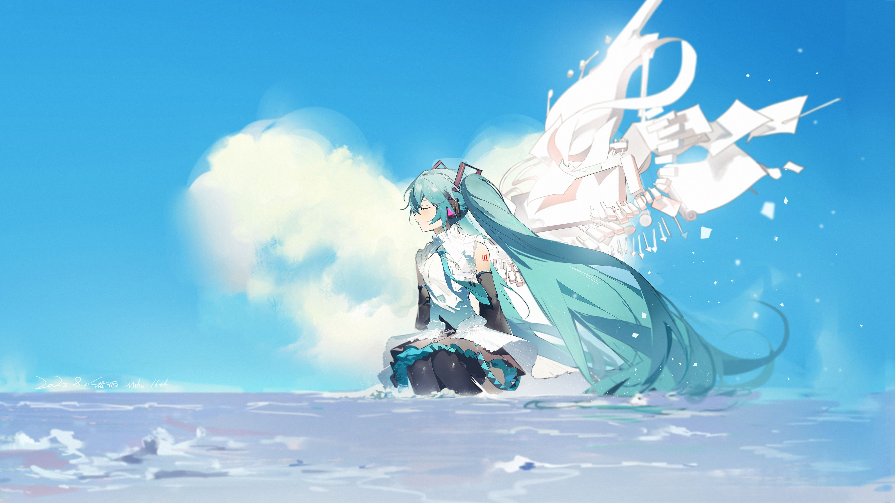
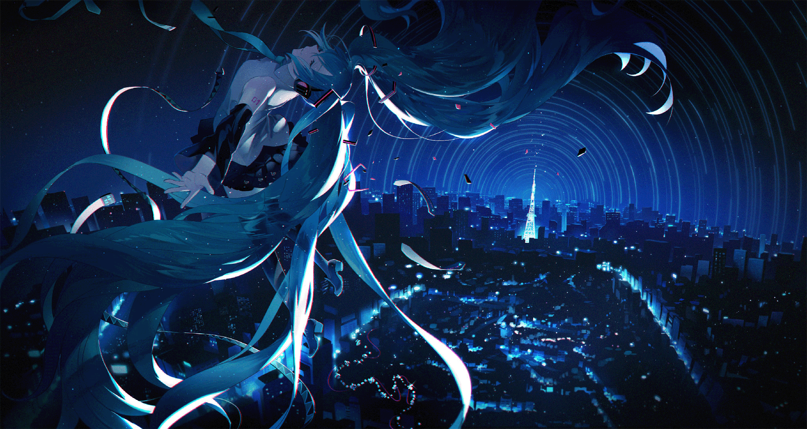

# dsh-plugin-css

由deepharness自己完成的适配 **DeepSeek Harness Web GUI**（`dsh web`）的客户端插件。

> **当前版本：v0.8.1** —— 适配 DSH v0.1.5（详见文末[版本记录](#版本记录)）

插件包名：`dsh-cherry-glass`。纯 client 插件：向页面注入一份全局样式表，覆写 DSH 的 `--dsw-*` 设计令牌，并在稳定 `data-*` 接缝上施加玻璃效果。亮/暗两套值跟随 DSH 外观设置（浅色/深色/跟随系统）自动切换，并兼容 dsh-desktop（Electron）桌面壳。

## 特性

- 背景图铺底，主对话页表面高度透明，背景图清晰可见
- 左侧栏、右侧 Sidebar 为半透明填充 + 渐变叠加的玻璃观感（不使用 backdrop-filter，避免破坏 fixed 弹层）
- 输入胶囊磨砂 + 聚焦光环（`:focus-within` 主题色描边）
- 设置面板、弹窗、菜单等浮层表面接近不透明，不受背景图干扰
- 代码块、滚动条、选中文本按 Cherry 蓝色调统一

## 效果预览

浅色主题：


深色主题：


## 背景图

主题内置两张背景原图（插件自托管，由 host 路由 `/plugins/dsh-cherry-glass/` 提供，不依赖外部图床；亮/暗主题自动切换对应图片）：

亮色背景图（3840×2160）：



暗色背景图（2048×1090）：



## 目录结构

```
dsh-plugin-css/
├── src/
│   ├── client/
│   │   ├── glass.css        # 主题样式（唯一需要编辑的文件）
│   │   ├── glass-css.js     # 由 glass.css 生成的 JS 模块（勿手改）
│   │   └── index.js         # 浏览器入口：注入/卸载 <style>
│   └── index.js             # 宿主入口（提供背景图静态路由）
├── scripts/
│   ├── build.mjs            # 一键构建（跨平台，优先用仓库自带 tsdown）
│   ├── build.ps1            # Windows 构建脚本（可指定 harness 检出）
│   ├── check-compat.mjs     # 对已安装宿主做令牌/接缝静态校验
│   ├── clean-dist.ps1       # 清理被注入到 dist/index.html 的旧样式
│   └── gen-css.mjs          # 从 glass.css 生成 glass-css.js
├── assets/                  # 背景原图（bg-light.jpg / bg-dark.png）
├── lib/                     # 构建产物（client bundle）
├── cordis.patch.yml         # bundle 补丁（行 id: cherry-glass）
└── package.json
```

## 安装

以下命令中的 `web` 为 profile 名称，请替换为你实际使用的 profile。

### 方式一：从 GitHub 仓库安装（推荐）

仓库已包含构建产物（`lib/`），安装后无需本地构建，适用于任何机器：

```sh
dsh plugin --profile web add github:BakaXXXXXL/dsh-plugin_css-web-
```

### 方式二：本地目录安装

适用于本机已有源码、需要修改主题的场合：

```sh
git clone https://github.com/BakaXXXXXL/dsh-plugin_css-web-.git
dsh plugin --profile web add <克隆到的目录>
```

### 方式三：手动编辑 profile

编辑 `$DSH_HOME/profiles/web/package.json`：

- `dependencies` 增加 `"dsh-cherry-glass": "github:BakaXXXXXL/dsh-plugin_css-web-"`
- `dsh.profile.bundles` 增加 `"dsh-cherry-glass"`

然后在 profile 目录执行：

```sh
corepack pnpm install
```

安装后重启 `dsh web`（bundle roster 在启动时组装），刷新页面生效。
移除插件：`dsh plugin --profile web remove dsh-cherry-glass` 后重启。

## 构建

```powershell
powershell -ExecutionPolicy Bypass -File scripts/build.ps1
```

构建使用 DSH checkout 自带的 tsdown（首次运行会自动创建 node_modules junction），无需额外安装依赖。产物为 `lib/client.js`（ModuleLoader 包装的浏览器 bundle）与 `lib/index.js`（宿主入口）。

## 更新主题（已安装后免重启热更新）

web profile 默认挂载 `client-hmr`。构建后将新 bundle 同步到 profile 的已安装副本，host 会检测到文件变化、重新哈希并广播 SSE，浏览器自动 dispose/reload 插件 fiber（旧样式移除，新样式注入），无需重启、无需刷新页面：

```powershell
powershell -ExecutionPolicy Bypass -File scripts/build.ps1
Copy-Item lib\client.js, lib\client.js.map $env:USERPROFILE\.dsh\profiles\web\node_modules\dsh-cherry-glass\lib\ -Force
```

验证：重新抓取 `http://127.0.0.1:3080/`，`window.__DSH_BOOT__` 中 `dsh-cherry-glass` 行的 `rev` 已变化。

## 常见问题

**改了 CSS / 构建了插件，但页面完全不变？设置页被挤进侧边栏窄框？**

检查 `deepseek-harness/apps/web/dist/index.html` 是否被注入了旧样式（特征：HTML 内有 `<style data-plugin="dsh-cherry-glass">` 标签）。HTML 内嵌的同名 style 标签会命中插件 client 的幂等守卫，导致插件自身的（更新的）样式表永远不被注入；旧版侧边栏 blur 又会让 fixed 定位的设置弹层被挤进侧边栏窄框。清理：

```powershell
powershell -ExecutionPolicy Bypass -File scripts/clean-dist.ps1
# 或重新构建 web：cd deepseek-harness && pnpm run build:web
```

`scripts/preview.ps1` 已禁用（它会把旧样式注入 dist/index.html，制造上述问题）。

## 版本记录

- v0.8.1：适配 DSH v0.1.5。新增 `--dsw-alias-link` 覆写（v0.1.5 新增令牌），链接规则改用该令牌以保留宿主 hover/focus 分类样式；新增 `--dsw-alias-label-caption` / `label-dimmed` 覆写，保证新右侧 Sidebar 与交付文件卡片在半透明表面上的对比度；v0.1.5 将原 Detail 面板重构为右侧 Sidebar（布局 slot 由 `details` 变为 `rightbar`，列容器带 `data-rightbar-col`），新增右栏玻璃外观并保持"侧栏子树内禁止 backdrop-filter"约束；构建脚本改为跨平台 `scripts/build.mjs`；新增 `scripts/check-compat.mjs`（`npm run check:compat`）对已安装宿主自动校验令牌与 `data-*` 接缝
- v0.8：适配 DSH v0.1.2-rc.1。新增 `--dsw-specific-sidebar-nav-item-active` / `hover` 令牌覆写（v0.1.2 新增）；新增 `--dsw-alias-toast-bg` / `tooltip-bg` 浮层近不透明覆写；新增 `--dsw-alias-label-primary` / `secondary` / `tertiary` 文字标签覆写，保证半透明表面上对比度；新增 `--dsw-alias-brand-primary-invert` / `brand-text` 覆写；新增 `--dsw-alias-bg-mask-*` 遮罩层覆写（灯箱/拖拽遮罩保持不透明）；新增过程折叠按钮 `[data-turn-process]`、回合尾操作 `[data-turn-tail]` 的半透明样式覆盖，与 v0.1.2 新增 UI 元素保持视觉一致；验证所有原有 43 个 `--dsw-*` 令牌均未重命名/移除，`data-slot='sidebar'` / `data-composer-card` / `data-ds-dark-theme` 等结构选择器仍然有效
- v0.7：背景图本地化。host 半身新增 webServer 懒绑定路由（`/plugins/dsh-cherry-glass/bg-light.jpg`、`bg-dark.png`），亮/暗主题背景图改为插件自托管原图（`assets/`，随包分发），不再依赖外部图床（原 `pic1.imgdb.cn` 链接在某些网络下不可达导致背景图丢失）；`package.json` `files` 增加 `assets` 目录
- v0.6：新增 dsh-desktop（Electron）背景图恢复规则（`html[data-dsh-desktop='true'] body`）
- v0.5：侧边栏/详情栏彻底移除 backdrop-filter（避免包含块破坏 fixed 设置弹层），毛玻璃观感改为半透明填充 + 渐变叠加
- v0.4：移除用户气泡结构装饰（描边、装饰线、磨砂、投影），仅保留原生半透明胶囊
- v0.3：移除消息滚动区与输入容器的 blur；透明度分层（内容表面透明、窗口表面不透明）
- v0.2：新增输入胶囊聚焦光环、过渡动画
- v0.1：初始适配
